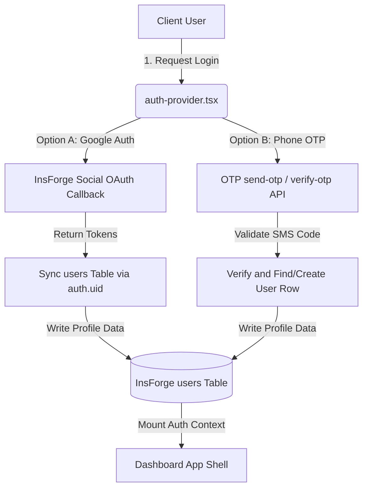
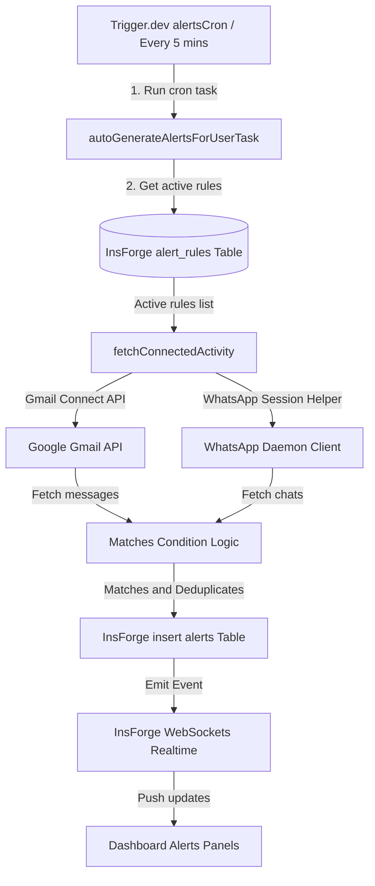
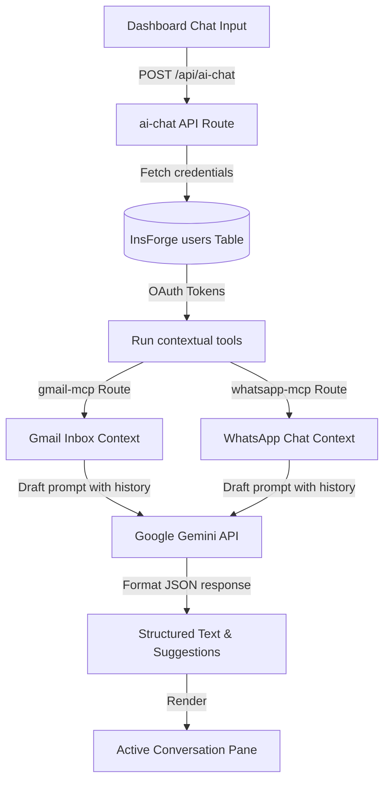
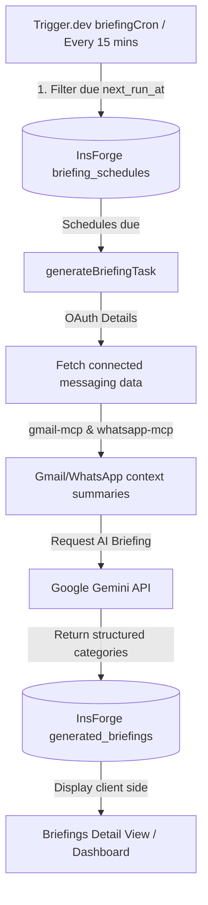
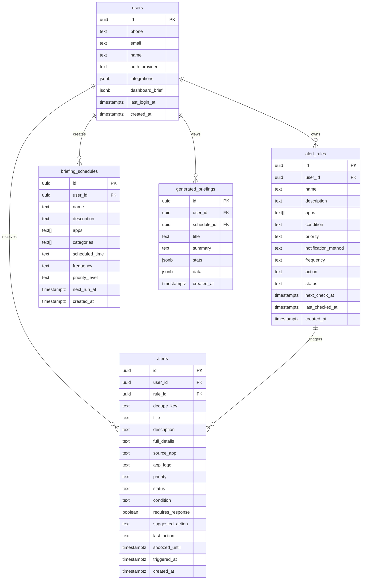

# Alyla AI — Enterprise Intelligence Assistant & Chief of Staff

<div align="center">
  
  
  <p align="center">
    <strong>A next-generation personal assistant dashboard connecting communication platforms, generating AI briefing portfolios, tracking automated intelligence alerts, and providing a unified assistant chat interface over synced application data.</strong>
  </p>

  <p align="center">
    <a href="https://nextjs.org"></a>
    <a href="https://typescriptlang.org"></a>
    <a href="https://insforge.dev"></a>
    <a href="https://trigger.dev"></a>
    <a href="https://aistudio.google.com"></a>
    <a href="LICENSE"></a>
  </p>
</div>

---

## 📖 Table of Contents

- [Project Overview](#-project-overview)
- [Key Features](#-key-features)
- [Technology Stack](#-technology-stack)
- [Architecture Overview](#-architecture-overview)
- [Folder Structure](#-folder-structure)
- [Screenshots](#-screenshots)
- [Installation Guide](#-installation-guide)
- [Environment Variables](#-environment-variables)
- [API Documentation](#-api-documentation)
- [Database Documentation](#-database-documentation)
- [Authentication & RBAC](#-authentication--rbac)
- [AI Implementation Engine](#-ai-implementation-engine)
- [Security Matrix](#-security-matrix)
- [Deployment Guide](#-deployment-guide)
- [Development Workflow](#-development-workflow)
- [Testing Suite](#-testing-suite)
- [Frequently Asked Questions (FAQ)](#-frequently-asked-questions-faq)
- [Roadmap](#-roadmap)
- [Contributing](#-contributing)
- [License](#-license)
- [Support](#-support)
- [Credits](#-credits)

---

## 🌟 Project Overview

**Alyla AI** acts as a digital Chief of Staff and AI Personal Assistant, resolving the fragmentation of modern business and daily communication. Today, knowledge is scattered across workspaces, communication streams, and dashboards. Alyla aggregates this data, processes it via advanced generative AI, tracks rules-based alerts, and formats the output into clean, actionable executive intelligence briefs.

### The Problem It Solves
1. **Communication Overload:** Users waste hours reading multiple inbox streams, group chats, and message feeds.
2. **Context Fragmentation:** Finding specific documents, contact references, or message threads requires searching multiple applications.
3. **Lack of Proactive Monitoring:** Traditional channels require manual checks to identify urgent problems or key actions.

### Target Users
- **Executives & Founders:** To aggregate business intelligence, scan daily briefs, and handle high-priority inbox events.
- **Project Managers & Leads:** To track timelines, detect blockers, and trigger instant follow-ups.
- **Developer Teams & Agencies:** To monitor alerts across operations, automate system statuses, and write context-aware replies.

### Key Benefits
* **Unified Context Hub:** Syncs Gmail and WhatsApp data directly with a server-side relational database using high-security integrations.
* **Proactive Executive Summaries:** Triggers automated briefings at scheduled times containing tasks and follow-up cards.
* **Real-time Rules Engine:** Auto-checks custom conditions, highlights high-priority tasks, and emits instant in-app alerts via WebSocket streams.

---

## 🛠️ Key Features

### 🧠 AI Features
* **Context-Aware Chat:** Real-time conversational assistant synced with Gmail and WhatsApp history.
* **Structured JSON Generation:** Produces strict briefs, tasks, and priority mappings via Google Gemini.
* **One-Click Drafts:** Automatically generates email responses or chat responses based on user commands.
* **Simulated Sandbox Mode:** Graces environments without active credentials by generating high-fidelity mock previews.

### 📊 Dashboard
* **Sleek Navigation Shell:** Sidebars, quick action triggers, and state panels.
* **Metrics Cards:** Real-time counts of unread emails, chat status, pending alert rules, and tasks.
* **Actionable Inbox View:** Aggregates messages and highlights unresolved, snoozed, or archived cards.

### ✉️ Gmail Integration
* **OAuth Callback Handoff:** Integrates Google Cloud Console credentials with user accounts.
* **MCP Tool Proxies:** Invokes Google API resources (list, get, search, send, draft) server-side.
* **Token Rotation:** Seamlessly processes token expiration and background refresh protocols.

### 💬 WhatsApp Integration
* **Session Manager:** Connects remote sessions using Whiskeysockets Baileys client.
* **QR Pair Handler:** Renders pairing status codes for seamless setup in the dashboard.
* **Groups & Contacts Sync:** Automatically indexes recent chat history, contacts list, and group notifications.

### 🚨 Alerts & Monitoring
* **Rules Editor:** Sets user-defined conditions, prioritize priority levels (`high`, `medium`, `low`), and assign rules.
* **Condition Matching Engine:** Monitors keywords and filters context strings.
* **Deduplication:** Utilizes unique `dedupe_key` parameters to prevent notification spam.

### 📅 Briefings Portfolio
* **Scheduler Console:** Configures multiple schedules (hourly, daily, weekly), app filters, and categories.
* **Detailed Briefing Pages:** Displays briefings split by emails, chats, tasks, mentions, and follow-ups.
* **Manual Dispatch:** Triggers instant summaries in a single click.

### 🔐 Security & Operations
* **Multi-Channel OTP:** Sends SMS/WhatsApp one-time-passwords via Sent.dm integrations.
* **Role-Based Protection:** Secures admin capabilities using JWT HTTP-only cookie sessions.
* **InsForge Row Level Security (RLS):** Binds data rows directly to the owner's `user_id`.

---

## 💻 Technology Stack

| Domain | Technology / Package | Version | Purpose |
| :--- | :--- | :--- | :--- |
| **Frontend Framework** | Next.js (App Router) | `^16.2.9` | High-performance React framework |
| **View Layer** | React & React DOM | `19.2.4` | Component architecture |
| **Styling** | Tailwind CSS / PostCSS | `^4` | Design token layouts and styling |
| **Database & BaaS** | `@insforge/sdk` | `^1.3.1` | Postgres operations, authentication, and WebSocket realtime |
| **Generative AI** | `@google/genai` | `^2.8.0` | Google Gemini structured analysis |
| **Background Jobs** | `@trigger.dev/sdk` | `^4.4.6` | Schedules, cron workflows, and queue worker logic |
| **SMS/WhatsApp OTP** | `@sentdm/sentdm` | `^0.29.0` | Secure code distribution and MFA delivery |
| **WhatsApp Sync** | `@whiskeysockets/baileys` | `^7.0.0-rc13` | Headless WhatsApp Web pairing engine |
| **Icons Library** | `lucide-react` / `@hugeicons/react` | Varies | Visual icons and system emojis |

---

## 📐 Architecture Overview

Alyla's core engine separates front-end interactions, serverless API operations, database hosting, and background queue processors.

### User Authentication Flow


### Background Alert Monitoring Flow


### AI Context Sync & Chat Engine


### Briefings Portfolio Scheduler


---

## 📂 Folder Structure

```text
├── app/                              # Next.js App Router Page Layouts & API Routes
│   ├── admin/                        # Dedicated Unified Admin Console Dashboard
│   ├── api/                          # Serverless Endpoint Controllers
│   │   ├── admin/                    # System stats and administrator login authentication
│   │   ├── ai-chat/                  # Context-enriched AI dialogue endpoint
│   │   ├── alerts/                   # Alert triggers, rule creation, and suggestions
│   │   ├── briefings/                # Schedules, AI draft previews, and briefings CRUD
│   │   ├── gmail-*/                  # Gmail callback OAuth and MCP tool helpers
│   │   ├── whatsapp-*/               # WhatsApp connection and MCP tool helpers
│   │   └── phone-auth/               # OTP generator, dispatch, and verify pipelines
│   ├── auth/                         # Authentication callback handlers
│   ├── dashboard/                    # Main app shell interface and detail views
│   ├── sign-in/                      # Unified client login portal
│   └── sign-up/                      # Unified client registration portal
├── components/                       # Client contexts and helper providers
│   ├── auth-provider.tsx             # User context hooks and session synchronizers
│   └── theme-provider.tsx            # Light/Dark stylesheet state selectors
├── db/                               # Relational database structures
│   └── alerts.sql                    # Postgres table schemas, indexes, and RLS policies
├── docs/                             # Project assets and guidelines
│   └── screenshots/                  # Screenshot placeholders and guidance readme
├── lib/                              # Shared utility helpers and client initializers
│   ├── admin-auth.ts                 # JWT generation and PBKDF2 cryptography functions
│   ├── alert-auto-generation.ts      # Keywords conditions filter and data scanner
│   ├── alerts-realtime.ts            # InsForge WebSocket dispatcher
│   ├── insforge.ts                   # Public BaaS client initializers
│   ├── insforge-admin.ts             # Secret server-side client bypasses
│   └── whatsapp.ts                   # WhatsApp Web pairing controllers
└── trigger/                          # Background scheduler configuration files
    ├── alerts.ts                     # Rule checkers and cron tasks
    └── briefing.ts                   # Scheduler portfolio pipelines
```

---

## 🖼️ Screenshots

<details>
<summary>📸 Expand to View Project Screenshot Galleries</summary>

### Landing Page


### Login Page


### Registration Page


### Dashboard


### AI Assistant


### Alerts


### Integrations


### Settings


### Pricing Page


### Mobile View


</details>

---

## 🚀 Installation Guide

### Requirements
* **Node.js:** version `20.x` or higher.
* **Database Platform:** An active [InsForge](https://insforge.dev) project.
* **Background Scheduler:** An active [Trigger.dev v3](https://trigger.dev) project.

---

### Step 1: Clone the Repository
```bash
git clone https://github.com/sabirprogrammer/ai_personal_agent.git
cd ai-personal-agent-main
```

---

### Step 2: Install Dependencies
```bash
npm install
```

---

### Step 3: Configure Environment Variables
Copy `.env.local` configuration variables to customize endpoints:
```bash
cp .env.local .env.development
```
*(Reference the [Environment Variables](#-environment-variables) section below to populate credentials.)*

---

### Step 4: Setup Database Tables
1. Open the SQL editor in your **InsForge Project Dashboard**.
2. Copy and apply the entire schema script from [db/alerts.sql](file:///c:/Users/sanam/Downloads/Compressed/ai-personal-agent-main/ai-personal-agent-main/db/alerts.sql).
3. Verify that the tables (`users`, `alert_rules`, `alerts`, `briefing_schedules`, `generated_briefings`, `otp_codes`) are properly provisioned.

---

### Step 5: Configure OAuth Settings
1. Navigate to the **Google Cloud Console**.
2. Select your project, enable the **Gmail API**, and open OAuth Consent configuration.
3. Add Authorized Redirect URIs matching your deployment:
   * Local: `http://localhost:3000/auth/gmail-callback`
   * Production: `https://your-domain.vercel.app/auth/gmail-callback`
4. Copy the Client ID and Client Secret parameters to your configuration keys.

---

### Step 6: Start Trigger.dev Environment
Initialize Trigger.dev tasks inside your workspace to support schedulers:
```bash
npx trigger.dev@latest dev
```

---

### Step 7: Run Development Server
Start the Next.js runtime environment:
```bash
npm run dev
```
Open [http://localhost:3000](http://localhost:3000) to access the application dashboard.

---

### Step 8: Build for Production
To optimize the workspace bundle and test production servers:
```bash
npm run build
npm run start
```

---

## 🔑 Environment Variables

| Variable Name | Purpose | Required? | Example Value |
| :--- | :--- | :--- | :--- |
| `APP_URL` | Root URL of your deployed application backend. | **Yes** | `https://alyla.vercel.app` |
| `NEXT_PUBLIC_APP_URL` | Exposed browser URL used for callbacks. | **Yes** | `https://alyla.vercel.app` |
| `NEXT_PUBLIC_INSFORGE_URL` | InsForge project endpoint URL. | **Yes** | `https://3ewxfrr2.us-east.insforge.app` |
| `NEXT_PUBLIC_INSFORGE_ANON_KEY` | Public anonymous access token. | **Yes** | `eyJhbGciOiJIUzI1NiIsInR5cCI...` |
| `INSFORGE_API_KEY` | Secret admin client access key. | **Yes** | `insforge_adm_secret_key_abc123` |
| `ADMIN_EMAIL` | Admin login user address. | Optional | `admin@alyla.ai` |
| `ADMIN_PASSWORD` | Admin login password. | Optional | `AdminSecretPass123!` |
| `ADMIN_JWT_SECRET` | Secret key used to sign admin cookies. | **Yes** | `7933343ea0e3db40118df7f6f8113...` |
| `GEMINI_API_KEY` | Google Gemini API Studio access key. | **Yes** | `AIzaSyD-abcde12345` |
| `GOOGLE_CLIENT_ID` | Google OAuth client key. | Optional | `12345-abcde.apps.googleusercontent.com` |
| `GOOGLE_CLIENT_SECRET` | Google OAuth secret key. | Optional | `GOCSPX-abcde12345` |
| `SENT_DM_API_KEY` | OTP dispatch API authentication token. | Optional | `sentdm_secret_abc123` |
| `SENT_DM_TEMPLATE_ID` | Sent.dm custom SMS template UID. | Optional | `6a729b2b-25c5-4172-8f43-1631f...` |
| `TRIGGER_SECRET_KEY` | Trigger.dev secret project key. | **Yes** | `tr_dev_abcde12345` |
| `NODE_ENV` | Application environment state. | Optional | `production` |

---

## 📡 API Documentation

### Admin Console Endpoints

#### `POST /api/admin/auth`
* **Purpose:** Authenticates administrative credentials and sets a secure JWT cookie.
* **Authentication Required:** No
* **Request Body:** `{ "email": "admin@alyla.ai", "password": "AdminPassword!" }`
* **Response (200):** `{ "success": true }`

#### `POST /api/admin/logout`
* **Purpose:** Immediately clears the active JWT admin cookie.
* **Authentication Required:** Yes (Admin Session)
* **Response (200):** `{ "success": true }`

#### `GET /api/admin/data`
* **Purpose:** Aggregates database lists of users, alerts, rules, and system statuses.
* **Authentication Required:** Yes (Admin Session)
* **Response (200):** `{ "success": true, "users": [...], "alerts": [...], "rules": [...], "systemStatus": {...} }`

---

### AI Chat Endpoints

#### `POST /api/ai-chat`
* **Purpose:** Queries Google Gemini using recent Gmail and WhatsApp messages as context.
* **Authentication Required:** Yes (User Session)
* **Request Body:** `{ "userId": "uuid", "prompt": "Summarize my day", "history": [...] }`
* **Response (200):** `{ "response": "Markdown response text", "suggestions": ["Quick command 1", "Quick command 2"] }`

---

### Alerts & Monitoring Endpoints

#### `GET /api/alerts`
* **Purpose:** Retrieves the most recent 50 alerts triggered for a specific user ID.
* **Authentication Required:** Yes (User Session)
* **Query Params:** `?userId=uuid`
* **Response (200):** `[ { "id": "uuid", "title": "...", "status": "triggered", ... } ]`

#### `POST /api/alerts/rules`
* **Purpose:** Registers a new custom conditions rule monitoring connected integrations.
* **Authentication Required:** Yes (User Session)
* **Request Body:** `{ "userId": "...", "name": "Rules Name", "apps": ["gmail"], "condition": "keywords..." }`
* **Response (200):** `{ "id": "uuid", "user_id": "...", "status": "active", ... }`

#### `POST /api/alerts/actions`
* **Purpose:** Updates an alert state (e.g. resolve, snooze) and dispatches WebSocket events.
* **Authentication Required:** Yes (User Session)
* **Request Body:** `{ "userId": "...", "alertId": "...", "action": "resolved" }`
* **Response (200):** `{ "id": "uuid", "status": "resolved" }`

#### `GET /api/alerts/suggestions`
* **Purpose:** Evaluates inbox context and suggests useful custom alert rules.
* **Authentication Required:** Yes (User Session)
* **Query Params:** `?userId=uuid`
* **Response (200):** `[ { "title": "...", "condition": "...", "action": "notify" } ]`

#### `POST /api/alerts/ai`
* **Purpose:** Generates AI summaries, recommended actions, or context-aware draft replies.
* **Authentication Required:** Yes (User Session)
* **Request Body:** `{ "alertId": "uuid", "feature": "summary" | "next_action" | "reply" }`
* **Response (200):** `{ "result": "AI generated string response..." }`

---

### Briefings Portfolio Endpoints

#### `GET /api/briefings`
* **Purpose:** Returns a list of generated briefs or retrieves details for a single briefing ID.
* **Authentication Required:** Yes (User Session)
* **Query Params:** `?userId=uuid` or `?userId=uuid&id=briefingUuid`
* **Response (200):** `{ "id": "uuid", "title": "...", "summary": "...", "stats": {...}, "data": {...} }`

#### `POST /api/briefings`
* **Purpose:** Dispatches an immediate briefing check, scraping communications data and generating AI responses.
* **Authentication Required:** Yes (User Session)
* **Request Body:** `{ "userId": "...", "scheduleId": "..." }`
* **Response (200):** `{ "id": "uuid", "title": "...", "summary": "..." }`

#### `GET /api/briefings/schedules`
* **Purpose:** Lists all briefing intervals configured for a user.
* **Authentication Required:** Yes (User Session)
* **Query Params:** `?userId=uuid`
* **Response (200):** `[ { "id": "uuid", "name": "Daily Briefing", ... } ]`

---

## 🗄️ Database Documentation

Alyla utilizes a Postgres database model structured around user identities and system monitoring configurations.

### Database Tables and Columns



### Table Schema Highlights

1. **`users`:** Core profile data. Stores OAuth credentials and status variables inside the `integrations` JSONB column.
2. **`alert_rules`:** Defines search criteria and target channels.
3. **`alerts`:** Generated monitoring findings. Integrates a unique constraint on `dedupe_key` to filter duplicate data rows.
4. **`otp_codes`:** Holds active verification SMS details (`phone`, `code`, `expires_at`) using server-managed access permissions.

### Indexes & Performance
* `alerts_dedupe_key_idx` on `alerts` (filtered `where dedupe_key is not null`).
* `alert_rules_user_status_next_check_idx` on `alert_rules(user_id, status, next_check_at)`.
* `alerts_user_created_idx` on `alerts(user_id, created_at desc)`.

---

## 🔒 Authentication & RBAC

Alyla AI implements a dual-layer security model to protect end-users and administrators:

### User Authentication
1. **Google OAuth:** Redirects users to Google's sign-in flow. Upon callback, Alyla exchanges the code for access and refresh tokens, linking them to the user's profile in the `users` database table.
2. **Phone OTP Auth:** Dispatches a 6-digit OTP code using Sent.dm. The code is saved inside the `otp_codes` table with a 10-minute expiry time. Upon input, the API verifies the code, creates or updates the user profile, and initializes the auth context.

### Role-Based Access Control (RBAC)
* **Standard User (Resource Owner):** Row Level Security (RLS) is enabled on all tables. A standard user can read and modify only their own data. RLS policies verify this:
  ```sql
  create policy "Users can read own alerts" on public.alerts
    for select to authenticated using (auth.uid() = user_id);
  ```
* **Administrator Role:** Accesses `/admin` pathways. The admin session cookie (`admin_session`) is signed using the `ADMIN_JWT_SECRET` key, verified via server middleware, and blocks non-authorized users.

---

## 🧠 AI Implementation Engine

Alyla utilizes Google Gemini (`gemini-2.5-flash`) to process and summarize incoming communications data.

### Analysis & Briefings
When a briefing runs, the system fetches unread emails and messages, serializes them as clean strings, and prompts Gemini:
* **Strict JSON Schemas:** Gemini returns structured JSON matching required keys (`title`, `summary`, `stats`, `data.tasks`, `data.follow_ups`).
* **Grounding Constraints:** AI configurations instruct Gemini to base summaries *only* on the provided emails/messages, preventing hallucinations.

### Suggested Actions
For active alerts, Alyla requests the best next step and drafts natural text replies for both email threads (2-4 paragraphs) and WhatsApp messages (1-3 sentences) using user context inputs.

---

## 🛡️ Security Matrix

* **Secret Token Isolation:** Sensitive environment credentials (`INSFORGE_API_KEY`, `GOOGLE_CLIENT_SECRET`, `GEMINI_API_KEY`) run only inside server environments. They are never exposed to client browsers.
* **Database RLS Policies:** InsForge databases use Row Level Security (RLS). Clients use the public `anonKey` with `auth.uid()` checks, while backend tasks bypass RLS safely using the secret admin key.
* **Secure Cookie Verification:** Admin session headers are set with `httpOnly`, `secure` (in production), and `sameSite: strict` properties.
* **OTP Sanitization:** OTP validation tables have no client policies. They are managed only by the server via admin configurations.

---

## 📦 Deployment Guide

### Deployed to Vercel
1. Install the Vercel CLI: `npm install -g vercel`
2. Run configuration commands inside your workspace: `vercel`
3. Open your Vercel Dashboard, select your project, and add all required parameters to the **Environment Variables** section.
4. Set production callback values in the Google Cloud Console matching your new domain.
5. Deploy: `vercel --prod`

### Self-Hosted Server
You can host Next.js on any Node.js environment:
1. Set up a VPS (e.g., Ubuntu) and configure Node.js v20+.
2. Clone the repository and run:
   ```bash
   npm install
   npm run build
   ```
3. Set your production keys in a local `.env` file.
4. Run the app using PM2 to manage processes:
   ```bash
   pm2 start npm --name "alyla-ai" -- start
   ```

### Docker deployment
If you prefer containerized deployments, use the following `Dockerfile` outline:
```dockerfile
FROM node:20-alpine AS base
WORKDIR /app
COPY package*.json ./
RUN npm ci
COPY . .
RUN npm run build
EXPOSE 3000
CMD ["npm", "start"]
```

---

## 🤝 Development Workflow

To maintain a clean and reliable codebase, developers must adhere to the following standards:

### Coding Standards
* **TypeScript:** Avoid `any`. Define specific interface contracts for API payloads, database models, and component properties.
* **React Components:** Keep components focused. Move helper business logic into custom hooks under the `lib/` folder.
* **Git Practices:** Work on separate feature branches. Create atomic commits and keep changes minimal.

### Build Checklists
1. Check for typescript errors:
   ```bash
   npm run build
   ```
2. Run linters to verify formatting rules:
   ```bash
   npm run lint
   ```
3. Verify that changes to backend routes do not break type definitions.

---

## 🧪 Testing Suite

Alyla AI features multiple verification pathways to ensure system stability.

### Manual Verification Flows

#### 1. OTP Authentication
* Open the sign-in portal, select phone verification, and input a phone number.
* Verify that the mock console outputs the generated code.
* Input the correct OTP, check that the dashboard loads, and verify that the `users` table registers a matching record.

#### 2. Connected Integrations
* Connect your Google Account from the dashboard settings tab.
* Trigger a manual briefing build.
* Verify that your inbox emails are correctly fetched and displayed.

#### 3. AI Chat Context
* Ask the AI chat assistant about your recent unread emails.
* Check that the response incorporates your actual inbox details.

---

## 💬 Frequently Asked Questions (FAQ)

#### 1. What models does Alyla AI use?
Alyla defaults to the `gemini-2.5-flash` model, which provides fast, cost-efficient, and structured text summaries.

#### 2. How is my Gmail data secured?
OAuth credentials are saved in your private database, protected by row-level security (RLS). They are never shared or sent to external servers except during official Google API requests.

#### 3. Can I run the project without a Gemini API Key?
Yes. If `GEMINI_API_KEY` is not configured, the application falls back to a sandbox simulation mode, returning mock briefings and chat data so you can test the UI.

#### 4. How does the WhatsApp sync work?
The backend uses a pairing client (`@whiskeysockets/baileys`) to run a headless session, syncing message details.

#### 5. Is Trigger.dev required for local development?
Yes, if you want to test cron jobs and scheduled briefing generation automatically. However, you can manually trigger briefings and alerts using the dashboard action buttons.

#### 6. Can I use a database other than InsForge?
Alyla is built around the InsForge SDK, which provides Postgres databases, authentication, and WebSockets. You would need to rewrite the `lib/insforge.ts` client to support other database setups.

#### 7. How does the alert rules engine work?
The system compares active user-defined alert rules with incoming inbox messages, matching text keywords (e.g., "urgent", "invoice", "action required").

#### 8. How do I change the briefing schedules?
You can create, update, or pause schedules in the **Briefings** tab of the dashboard. Trigger.dev monitors changes in the `briefing_schedules` table.

#### 9. Why does my WhatsApp connection status show "connecting"?
WhatsApp sessions connect via pairing code inputs. If pairing is interrupted, disconnect and request a new code.

#### 10. Does Alyla store my WhatsApp password?
No. WhatsApp Web uses token-based pairing codes, so your password is never stored or processed.

#### 11. Can I configure Slack or Discord integrations?
Gmail and WhatsApp are natively supported. You can add more platforms by editing the integration handlers in `lib/alert-auto-generation.ts`.

#### 12. How does the system prevent notification spam?
Every alert has a unique `dedupe_key` (e.g., `gmail_msg_123`). If an alert with that key already exists, the database ignores the insert.

#### 13. What happens if Google OAuth tokens expire?
Google refresh tokens are used in the background to automatically request new access tokens when they expire.

#### 14. How can I access the admin console?
Navigate to `/sign-in` and sign in with the email and password configured in your environment variables (`ADMIN_EMAIL` and `ADMIN_PASSWORD`).

#### 15. Is there a mobile application?
Alyla is a fully responsive PWA-ready Next.js application that adapts to mobile, tablet, and desktop views.

---

## 🗺️ Roadmap

### Completed Features
- [x] Next.js App Router workspace scaffolding.
- [x] InsForge database, social auth, and WebSocket integration.
- [x] Phone OTP authentication delivery via Sent.dm.
- [x] Google OAuth callbacks and Gmail data access.
- [x] Headless WhatsApp Web pairing session manager.
- [x] Custom rules-based alert generator.
- [x] Background schedule tasks via Trigger.dev.
- [x] Unified administrative data console.

### Upcoming Features
- [ ] Native Slack, Discord, and Outlook connectors.
- [ ] Vector database embeddings for long-term memory.
- [ ] Email/SMS notification dispatch for high-priority alerts.
- [ ] Custom system dashboards for team workspaces.

---

## 🤝 Contributing

We welcome community contributions:
1. Fork the project repository.
2. Create a new branch: `git checkout -b feature/your-feature`
3. Commit your changes: `git commit -m 'Add new feature'`
4. Push the branch: `git push origin feature/your-feature`
5. Submit a Pull Request.

Please ensure your changes conform to the existing folder structure, pass typescript builds, and run linters.

---

## 📄 License

This project is licensed under the MIT License. See the [LICENSE](LICENSE) file for more information.

---

## 📞 Support

If you run into issues or have questions, reach out via the following channels:
* ✉️ **Email Support:** support@alyla.ai
* 🌐 **Documentation:** [alyla.ai/docs](https://alyla.ai/docs)
* 💬 **Website:** [alyla.ai](https://alyla.ai)
* 🐛 **GitHub Issues:** [github.com/sabirprogrammer/ai_personal_agent/issues](https://github.com/sabirprogrammer/ai_personal_agent/issues)

---

## 🏆 Credits

Alyla AI is built using the following services and platforms:
* [Next.js](https://nextjs.org)
* [InsForge](https://insforge.dev)
* [Google Gemini AI](https://aistudio.google.com)
* [Trigger.dev](https://trigger.dev)
* [Sent.dm](https://sent.dm)
* [Lucide Icons](https://lucide.dev)
* [Whiskeysockets Baileys](https://github.com/WhiskeySockets/Baileys)
